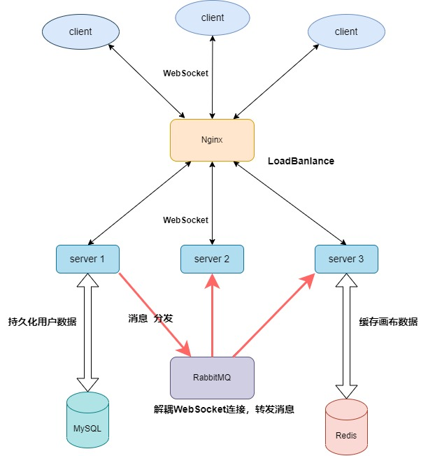

# Collaboration Whiteboard
# **This is a real-time collaborative drawing whiteboard, let's join it**

**这是一个远程协作型白板，你可以实时编辑白板，每个人都可以通过你创建的白板id加入进去一同协作🤗**

## 模块分工：

前端开发：李佳燕

后端开发：唐胜奕、张浩宇

## 项目预览

## 线上访问地址

http://114.55.132.72:82/#/home

## 如何在本地运行

### 前端运行

1. 下载克隆仓库

```JavaScript
git clone https://github.com/Guucat/whiteboard.git
```

1. 安装依赖

```JavaScript
cd frontend
pnpm install
```

1. 对于开发阶段

```JavaScript
cd frontend
pnpm run dev
```

1. 打包部署

```JavaScript
cd frontend
pnpm run build
```

1. 本地预览项目

```JavaScript
cd frontend
pnpm run preview
```

### 后端运行

端口为8080

方法1. 需要Go运行环境

```Dockerfile
cd backend
go run main.go
```

方法2. 需要安装Docker

```Dockerfile
docker pull guptang/wb
docker run --name wb -p 8080:8080 -d guptang/wb
```

## 项目流程图

This content is only supported in a Feishu Docs

## 目前实现的功能

1. ### 开发完成:

登录注册页面及错误提示(✔)

箭头(✔)

自由绘画(✔)

直线、文字、矩形、菱形、三角形、圆形、椭圆(✔)

清空白板(✔)

历史记录（撤销，恢复）**(✔)**

创作者创建白板开始绘画(✔)

协作者通过白板id进入白板(✔)

加入白板时输入白板id的错误处理(✔)

实时展示当前协同用户列表(✔)

白板创建者对其设置只读、编辑模式(✔)

退出白板(✔)

创建者解散白板(✔)

对白板进行添加新页操作(✔)

创作者与协作者实时传送自己绘画的内容(✔)

协作者在加入白板后能够收到创作者之前绘画的内容(✔)

初始设置选择，设置初始画笔颜色、填充颜色、背景颜色、字体大小(✔)

选中除自由画笔外的形状对其进行描边颜色、线宽、透明度、角度的编辑(✔)

对选中的图形进行移动、缩放、删除(按下删除键删删除当前图形)操作(✔)

在箭头模式下，可选择多个图形进行删除操作(✔)

导出白板当前的内容，保存时可选择导出为图片/json文件(✔)

导入之前导出的内容，导入json文件，默认导入的内容添加到新页(✔)

1. ### 待开发的功能：

- 多人协作时，能看到不同的光标代表不同的用户

- 细化操作白板粒度

1. ### 时间富裕可做：

聊天室

颜色提取

上传图片

- 画板背景设置

## 接口文档地址

https://www.yuque.com/lalala-geaad/yg22yp/dgo5am

## 前端项目设计文档

### 技术栈：

**React、TypeScript、WebSocket、Fabric.js、Recoil**

### 适配PC端分辨率问题

使用postcss-px-to-viewport进行适配

### 提取加入白板和创建白板的CanvasBoard组件

首先我们需要找到加入白板与创建白板的共同点：

- 都可以对白板进行操作，有关白板的操作可以封装成一个类

区别：

- 加入白板通过白板id即可进入白板

- 加入白板进入时得到的白板内容可能不为空，存在之前创建者或其他协作者绘画的内容

- 创建白板需要登录才能进行创建

- 创建白板的白板是默认白板，里面没有绘画的内容

### 封装CanvasBoard组件

在CanvasBoard组件

- 编写侧边栏选择以及撤销/重做操作的函数

- 编写底部工具栏以及顶部工具栏

- 初始化webSocket连接，对加入白板以及创建白板的webSocket进行判断

- 在初始化webSocket连接中需要监听服务端传递过来的数据，比如加入白板后/协作者之间的实时传送消息，具体消息字段可查看接口文档

- 初始化画板类（这里有一个踩坑点：左侧工具栏切换时，需要直接对画板类的selectTool进行改变，而不能使用useState()改变当前选择的工具后再传递给画板类，因为这样会导致画板类的鼠标事件监听的this是初始化的this，没有进行改变，我也不知道这是为啥😥）

### 封装画板类

#### 初始化画板

需要判断下是否存在画布，避免重复渲染

对其初始化操作有

```JavaScript
 this.canvas = new fabric.Canvas(this.type)
// 禁止用户进行组选择
this.canvas.selection = false
// 设置当前鼠标停留在
this.canvas.hoverCursor = 'default'
// 重新渲染画布
this.canvas.renderAll()
 // 记录画布原始状态
this.stateArr.push(JSON.stringify(this.canvas))
this.stateIdx = 0
```

#### 事件监听

主要是对鼠标按下事件监听，在后续编辑时应该会加上对象事件监听

**鼠标按下事件**

因为有文本对象，就需要在按下时判断一下是否存在文本对象以及当前是不是文本类型

需要记录当前按下的点在画布中的位置，因为我直接设置画布大小为整个屏幕，就不需要相对位置，此外还需要对文本对象和其他类型分开判断一下，其他类型为绘画模式，而文本并不是绘画模式

**鼠标移动事件**

这个是绘制图形的核心事件，在里面进行类型的判读那并初始化要绘制的类型，然后进行绘制

**鼠标抬起事件**

这个是数据传送的核心，我们在抬起鼠标时，需要将我们现在画布的内容传递给其他的协作者进行实时共享

**物体被选中事件**

点击物体选中时，弹出编辑该物体的属性设置框进行实时编辑

**选中其他物体事件**

选中其他物体时切换属性，更新当前点击的物体属性

**点击空白处事件**

取消选中

#### 对于各个小的工具的实现

**自由画笔**

在fabric.js中，自由画笔时设置属性来实现，与其他的图形不太一样，我们需要单独判断，只有在自由画笔时我们将其画布的模式设置为绘画模式

```JavaScript
this.canvas.isDrawingMode = true
```

**文本**

文本对于其他图形也是比较特殊的一个，我们需要单独进行判断

**其他各个形状**

因为这些形状fabric.js提供了默认的基本图形，我们需要初始化他们的数据，根据一些数学方法得到他们跟随鼠标移动时的半径，宽高这些值，然后就可以根据这些值绘制图形，他们有一些相似之处，所以我们可以在初始化后封装一个方法去绘制

```JavaScript
  //因为这里我们要绘制的形状可能有很多，他们在fabric里面的类型也不相同，所以则这里暂时使用any
  drawingGraph(canvasObject: any) {
    // 禁止用户选择当前正在绘制的图形
    canvasObject.selectable = false
    // 如果当前图形已绘制，清除上一次绘制的图形
    if (this.drawingObject) {
      this.canvas.remove(this.drawingObject)
    }
    // 将绘制对象添加到 canvas中
    this.canvas.add(canvasObject)
    // 保存当前绘制的图形
    this.drawingObject = canvasObject
  }
```

#### 撤销/重做操作

目前选中样式和到第一步不能再撤销以及最新的时候不能再重做的样式还未实现(✔)，只实现了他的功能

设置一个数组以及当前的index值，在每次鼠标抬起后，将当前画布的信息使用`JSON.stringify(this.canvas)`存储，让index++，然后当我们点击撤销时传入-1，点击重做时传入+1

根据传入的值以及index值得到最终的curIndex值，拿到数组中curIndex指向的值的画布数据，然后通过`loadFromJSON`渲染出来，这里要注意的是渲染后需要将这个画布的数据通过websocket传递给其他协作者,这里要注意需要在执行撤销/重做后把撤消重做模式取消，不然会导致存储数组切换异常

#### 选中图形

在事件监听中添加监听图层对象选中事件selection:created，如果选中了图层对象，在选中的图形对象上编辑时要注意不能再继续绘制了

#### 导出json文件

这里有一个踩坑点，因为我导出的时整个画布的json数据，最开始是直接作为a标签的url进行下载，但后面发现url的长度有限制会导致画布的json数据被裁掉，最后通过使用blob转换为二进制来进行下载

#### 新建一页及导入json文件

这一个点是我卡的蛮久的一个功能，主要目前的实现

创建者点击新建一页，分页组件实时更新，默认跳转到最新的一页，侧边栏，底部栏以及顶部栏需要动态绑定当前画布，此时协作者加入进去，收到所有画布的数据并实时更新展示，协作者点击创建新页，此时所有人会收到type=5的消息，里面有最新创建的画布id及数据，然后所有人动态添加最新的数据

在写作过程中，有人导入json文件到白板，默认新建一页，导入者自动跳转到最新的一页，其他人不受影响，但在最后动态添加了一页

## 后端设计思路



### 技术栈：

基于**Go**语言实现，**WebSocket、Redis、RabbitMQ、MySQL、Nginx**

项目主要设计思路是MySQL用来持久化用户账号信息，采用Redis作缓存，Websocket用来实时传输画布数据，为了实现消息解耦，使用RabbitMQ分发消息，同时使得项目支持横向扩展，由于数据没有存在服务器本地，因此Redis还用来实现了分布式锁，用来同步画布数据。

### 创建白板

收到用户请求，随机生成一个不重复的白板ID，将白板数据缓存至Redis数据库，并通过白板ID创建消息队列，然后将协议升级成WebSocket协议，最后开始读取和接收自己和其他用户的消息。

### 进入白板

根据用户的请求传过来的白板ID，如果未携带token，则为匿名进入（系统随机生成数字标记名字），携带token，则按用户名进入。通过白板ID绑定消息队列，然后将协议升级成WebSocket协议，最后开始读取和接收自己和其他用户的消息。

### 退出白板

根据白板ID和用户名退出房间，发送信息给白板内的其他用户，更新白板内的用户在线列表，删除用户的消息队列，最后关闭websocket连接，当白板人数为0时，对白板设置过期时间，过期时间内仍可以继续访问。

### 解散白板

根据白板ID和创建者解散白板，对解散人进行校验（是否为创建者），校验成功，删除对应的消息队列，发送解散信息给其他用户，其他用户删除自己的队列，并关闭websocket连接。

### 添加新页

同时只有一个用户可以添加新页（通过Redis实现的分布式锁实现），用户可选择是否导入json文件来添加新页，将添加新页的信息转发给其他用户。

### 模式转换

模式有只读和协作两种模式，创建白板默认为协作模式，只有白板创建者可以切换模式，切换成功后将模式转换信息转发给其他用户，当模式为只读时，用户无法写入消息。

### 消息类型

```Go
EnterBoardSign       = 1 // 进入房间        
SequenceBoardSign    = 2 // 序列化消息  
ExitBoardSign        = 3 //退出房间
DissolveBoardSign    = 4 //解散房间        
AddNewPageSign       = 5 //新增一页消息  
SwitchModeSign       = 6 //编辑模式切换  
UserCountChangedSign = 7 //用户数改变     
ForbiddenWrite       = 8 //禁止写入          
```
