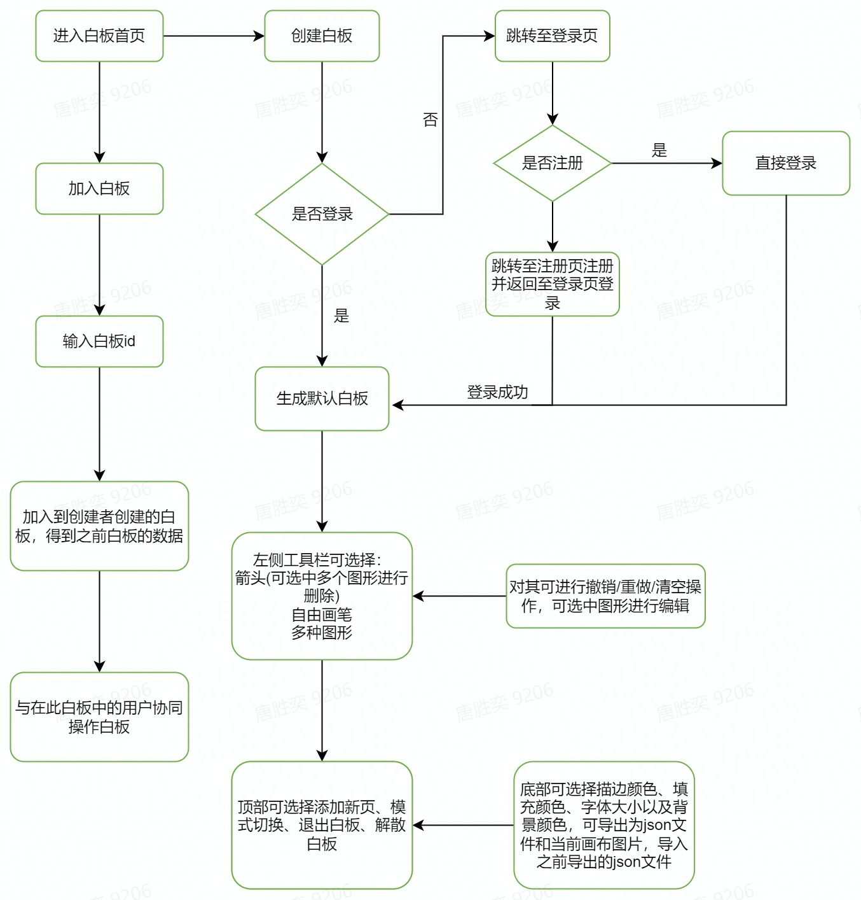

# Collaboration Whiteboard
# **This is a real-time collaborative drawing whiteboard, let's join it**

**这是一个远程协作型白板，你可以实时编辑白板，每个人都可以通过你创建的白板id加入进去一同协作🤗**

## 模块分工：

前端开发：李佳燕

后端开发：唐胜奕、张浩宇

## 项目预览

视频演示： 

## 线上访问地址

http://114.55.132.72:82/#/home

## 如何在本地运行

### 前端运行

1. 下载克隆仓库

```JavaScript
git clone https://github.com/Guucat/whiteboard.git
```

2. 安装依赖

```JavaScript
cd frontend
pnpm install
```

3. 对于开发阶段

```JavaScript
cd frontend
pnpm run dev
```

4. 打包部署

```JavaScript
cd frontend
pnpm run build
```

5. 本地预览项目

```JavaScript
cd frontend
pnpm run preview
```

### 后端运行

端口为8080

方法1. 需要Go运行环境

```Dockerfile
cd backend
go run main.go
```

方法2. 需要安装Docker

```Dockerfile
docker pull guptang/wb
docker run --name wb -p 8080:8080 -d guptang/wb
```

## 项目流程图



## 目前实现的功能

### 开发完成:

登录注册页面及错误提示(✔)

箭头(✔)

自由绘画(✔)

直线、文字、矩形、菱形、三角形、圆形、椭圆(✔)

清空白板(✔)

历史记录（撤销，恢复）**(✔)**

创作者创建白板开始绘画(✔)

协作者通过白板id进入白板(✔)

加入白板时输入白板id的错误处理(✔)

实时展示当前协同用户列表(✔)

白板创建者对其设置只读、编辑模式(✔)

退出白板(✔)

创建者解散白板(✔)

对白板进行添加新页操作(✔)

创作者与协作者实时传送自己绘画的内容(✔)

协作者在加入白板后能够收到创作者之前绘画的内容(✔)

初始设置选择，设置初始画笔颜色、填充颜色、背景颜色、字体大小(✔)

选中除自由画笔外的形状对其进行描边颜色、线宽、透明度、角度的编辑(✔)

对选中的图形进行移动、缩放、删除(按下删除键删删除当前图形)操作(✔)

在箭头模式下，可选择多个图形进行删除操作(✔)

导出白板当前的内容，保存时可选择导出为图片/json文件(✔)

导入之前导出的内容，导入json文件，默认导入的内容添加到新页(✔)

### 待开发的功能：

- 多人协作时，能看到不同的光标代表不同的用户

- 细化操作白板粒度

### 时间富裕可做：

* 聊天室

* 颜色提取

* 上传图片

